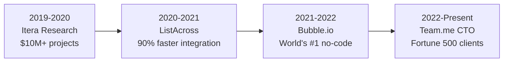

# Dmytro Pletenskyi | CTO & Architect

 

## About Me

I'm Dmytro, a **Frankfurt-based CTO & Architect** who bridges the gap between technical excellence and business strategy. Since 2019, I've progressed from delivering **$10M+ projects** to leading founding teams and securing **Fortune 500 clients**, all while maintaining hands-on development.

**What makes me different:** While most CTOs only strategize, I ship production code daily. While most developers just build features, I build companies. From architecting Bubble's microservices (millions of users) to securing enterprise clients like **HiBob, Payoneer, Gong, Mend** at Team.me.

 

## 📊 Career Impact

| **Scale Achieved** | **Teams Built** | **Value Delivered** |
| :---: | :---: | :---: |
| **Fortune 500** clients secured | **15+** developers mentored | **$10M+** in project value |
| **Millions** of users served | **4** teams led successfully | **From 0 to enterprise** scale |
| **HiBob, Payoneer, Gong** + 5 more | **CTO** at founding stage | **3 weeks → 3 days** at ListAcross |

 

## 💼 Professional Journey

<b>View Detailed Experience</b>

### **Team.me** | CTO & Co-founder (2022 - Present)
- Architected video recruiting platform from zero to enterprise scale
- Secured Fortune 500 clients including HiBob, Payoneer, Gong, Komodor
- Implemented SOLID architecture enabling rapid feature development
- Leading technical strategy while maintaining hands-on development

### **Bubble** | Team Lead Developer (2021 - 2022)  
- Led development for world's largest no-code platform (millions of users)
- Architected microservices handling massive scale
- Mentored team of 6 developers

### **ListAcross** | Senior Full-Stack Developer (2020 - 2021)
- Reduced marketplace integration time by 90% (3 weeks → 3 days)
- Implemented adapter pattern architecture for scalability
- Led cross-functional development team

### **Itera Research** | Full-Stack Developer (2019 - 2020)
- Delivered 5 projects worth $10M+ total budget
- Maintained 100% on-time delivery across concurrent projects

 

## 🚀 Featured Projects

### [Team.me](https://teamme.io/) - Enterprise Video Recruiting Platform
*Current Role: CTO & Co-founder (2022 - Present)*

**Problem:** Traditional recruiting is slow and impersonal  
**Solution:** Scalable video platform with enterprise-grade features  
**Impact:** Fortune 500 adoption including **HiBob, Payoneer, Gong, Mend, Komodor, Aiola, Skai**  
**Tech Stack:** `React` `Next.js` `NestJS` `Microservices` `WebRTC` `SOLID Architecture`

---

### [ecolog.nvim](https://github.com/ph1losof/ecolog.nvim) - Open Source Developer Tool

**Problem:** Developers waste hours managing environment variables across projects  
**Solution:** All-in-one Neovim toolkit with smart autocompletion for 12+ languages  
**Impact:** **139+ stars**, **1K+ active users**, integrated with Hashicorp Vault & AWS  
**Tech Stack:** `Lua` `Neovim API` `Security-first design`  

 

## 🛠 Technical Stack

**Languages:** `TypeScript` `JavaScript` `Rust` `Python` `Lua`

**Frontend:** `React` `Remix` `Tailwind CSS`

**Backend:** `Next.js` `Node.js` `NestJS` `Express` `GraphQL` `REST` `GRPC`

**Infrastructure:** `Docker` `Kubernetes` `AWS` `Azure` `Redis` `RabbitMQ` `PostgreSQL` `MySQL` `SQLite`

**Architecture:** `Event-driven` `SOLID` `Design Patterns` `Scalable Systems` `Microservices`

 

## 🎯 Currently

- **🏢 Role:** CTO at Team.me (Frankfurt, Germany)
- **🔨 Building:** Next-generation developer tools and scalable platforms
- **💡 Focus:** Bridging technical excellence with measurable business outcomes

 

## 📬 Let's Connect

I'm interested in **technical leadership**, **architecture challenges**, and **innovative projects**.

**Available for:** Architecture consultations • Technical advisory • CTO mentorship

 

---

  <i>"Most developers build features. Most CTOs just strategize. I do both."</i>

